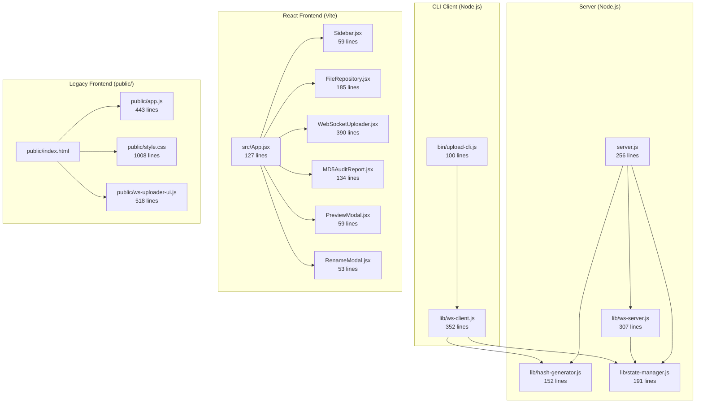

# CloudVault `files-upload` — Historical Code Review

> This document describes the repository as reviewed on 2026-08-02 and is retained for history. It is superseded by the current implementation and verification results on `main`; the previously listed path-traversal, arbitrary-scan, dummy-browser-chunk, resume-offset, missing-auth, legacy-frontend, and per-chunk-state-write findings have since been addressed.

> Review date: 2026-08-02 · Repo: CloudVault `files-upload`

---

## 1. Repository Overview

| Metric | Value |
|---|---|
| Total source files (excl. node_modules, dist) | 23 files |
| Total source lines | **5,408** |
| Git commits | 3 |
| Dependencies (runtime) | express, multer, ws, react, react-dom, lucide-react |
| Dependencies (dev) | vite, @vitejs/plugin-react |
| Node.js backend | Express + raw `http` + `ws` WebSocket server |
| Frontend | React 19 + Vite 8 (also legacy `public/` vanilla JS fallback) |

### Git History
```
6c9336b  Feat: Migrate frontend to React + Vite with Lucide icons
dec7b8e  Docs: Add documentation for WebSocket batch uploader
2590f9f  Initial commit: Stateful WebSocket MD5 Batch Uploader Repository
```

---

## 2. Architecture Map



---

## 3. File-by-File Review

### Backend Modules

#### [`server.js`](server.js) — 256 lines
Express server with REST API + WebSocket upgrade handler.

| Item | Assessment |
|---|---|
| Purpose | HTTP API (files CRUD, upload, stats, hash scan) + static serving + WS binding |
| ✅ Strengths | Clean endpoint separation, smart dist/public fallback, MD5 on file list |
| 🐛 Bug | **L74–106**: `GET /api/files` computes MD5 for every file on every request. Catastrophic for large upload directories — O(n × filesize) I/O per page load |
| 🐛 Bug | **L80**: Skips `.json` and `.tmp` files by suffix, but `server_state.json` lives in uploads. If user uploads a `.json` file, it's silently hidden |
| ⚠️ Security | **L173–186**: `DELETE /api/files/:filename` — no path traversal protection. A request to `DELETE /api/files/..%2F..%2Fserver.js` could delete arbitrary files |
| ⚠️ Security | **L190–215**: Same traversal risk on `PATCH /api/files/:filename` rename endpoint |
| ⚠️ Security | **L218–230**: `POST /api/hash/scan` accepts arbitrary `sourcePath` from client body — server scans any directory on the filesystem. This is a **critical RCE-adjacent vulnerability** on a public server |
| 💡 Suggestion | Cache MD5 hashes or compute lazily, not on every `GET /api/files` call |
| 💡 Suggestion | Validate filenames contain no path separators (`/`, `\`, `..`) |

#### [`lib/hash-generator.js`](lib/hash-generator.js) — 152 lines
Streaming MD5 hash generator with path normalization.

| Item | Assessment |
|---|---|
| ✅ Strengths | Memory-efficient streaming hashes, handles single files and directories, progress callbacks, cross-platform path normalization |
| ✅ Strengths | `normalizePath` correctly handles Windows backslashes for `md5sum` compatible output |
| ⚠️ Note | `normalizePath` is computed (L70) but only stored in the return object — the actual `fs.existsSync` check (L72) uses the raw `sourcePath`, which is correct |
| 💡 Suggestion | Could use `crypto.createHash('sha256')` as configurable option since MD5 is cryptographically broken |

#### [`lib/state-manager.js`](lib/state-manager.js) — 191 lines
Persistent JSON state file manager for upload session tracking.

| Item | Assessment |
|---|---|
| ✅ Strengths | Atomic writes via temp file + rename pattern (L42–45), smart session merging preserving verified files, clean status enum (`pending → uploading → uploaded → verified → failed`) |
| ⚠️ Performance | `saveState()` is called on every `updateFile()` call (L129). During chunked uploads this means a synchronous JSON write to disk **per chunk** (every 256KB). For large uploads this creates heavy I/O |
| 💡 Suggestion | Debounce or batch state saves — e.g. save every N chunks or every 2 seconds |

#### [`lib/ws-server.js`](lib/ws-server.js) — 307 lines
WebSocket upload server handling chunked file reception, MD5 verification, and audit.

| Item | Assessment |
|---|---|
| ✅ Strengths | Proper `noServer` mode for HTTP upgrade, resumption via server-side offset detection, per-file MD5 verification after upload completion |
| 🐛 Bug | **L142**: `fs.createWriteStream(targetPath, { flags, start: offset })` — using `start` with `flags: 'a'` (append mode) is contradictory. The `start` option only works with `flags: 'r+'` or `'w'`. In append mode the `start` is ignored and data is always appended at the end. This means resume-from-offset may produce corrupted files if the existing file was partially written |
| ⚠️ Security | **L69**: `path.join(uploadsDir, fileItem.relativePath)` — if `relativePath` contains `../`, it escapes the uploads directory. No sanitization on incoming WebSocket payloads |
| ⚠️ Memory | **L140**: `Buffer.from(data, 'base64')` — each 256KB chunk is sent as base64 over JSON, inflating payload by ~33%. For large files this is significant overhead |
| 💡 Suggestion | Use WebSocket binary frames instead of JSON+base64 for chunk data |

#### [`lib/ws-client.js`](lib/ws-client.js) — 352 lines
Node.js CLI WebSocket uploader client.

| Item | Assessment |
|---|---|
| ✅ Strengths | Clean class design, auto-reconnect on disconnect (L117–120), real-time speed and ETA calculations, proper `fs.openSync/readSync/closeSync` for chunk reading |
| 🐛 Bug | **L117–120**: Reconnect logic calls `connectWebSocket()` after 3s, but after reconnecting there's no `INIT_SESSION` resend — the new socket will receive messages but the server won't have an active session context |
| 💡 Suggestion | On reconnect, automatically re-send `INIT_SESSION` |

#### [`bin/upload-cli.js`](bin/upload-cli.js) — 100 lines
CLI entry point for batch uploads.

| Item | Assessment |
|---|---|
| ✅ Strengths | Clean argument parser, good help text with examples, inline progress display using `\r` carriage returns |
| ⚠️ Minor | No shebang `chmod +x` set — file has `#!/usr/bin/env node` but isn't executable |

---

### React Frontend (src/)

#### [`src/App.jsx`](src/App.jsx) — 127 lines

| Item | Assessment |
|---|---|
| ✅ Strengths | Clean tab-based routing, proper state lifting for modals, `useEffect` for initial data fetch |
| 💡 Suggestion | File upload success should show a toast notification instead of silently refreshing |

#### [`src/components/WebSocketUploader.jsx`](src/components/WebSocketUploader.jsx) — 390 lines

| Item | Assessment |
|---|---|
| 🐛 **Critical Bug** | **L187–198**: `sendChunk()` creates **dummy data** (`new Array(end - offset + 1).join('x')`) instead of reading actual file contents. The browser `WebSocketUploader` cannot access the local filesystem — it sends garbage bytes to the server. The uploaded files will be filled with the character `'x'` and will **always fail MD5 verification** |
| ⚠️ Design | This component is a browser-side UI but the actual chunked upload requires filesystem access (Node.js `fs.readSync`). The browser Web API has no way to read from arbitrary local paths like `D:\source-folder`. This entire tab only works correctly via the CLI client |
| 💡 Fix Path | For browser uploads, use `<input type="file">` + `File.slice()` to read real chunks via `FileReader` API, or redesign this tab as a monitoring dashboard for CLI uploads only |

#### [`src/components/PreviewModal.jsx`](src/components/PreviewModal.jsx) — 59 lines

| Item | Assessment |
|---|---|
| 🐛 Bug | **L42**: CSS syntax error — `margin: '0 auto 16px display: block'` is invalid. Missing semicolon/comma between properties |
| ✅ Fine | Image/audio/video preview correctly uses element tags |
| 💡 Suggestion | Missing text/code file preview (the legacy `public/app.js` had this) |

#### [`src/components/FileRepository.jsx`](src/components/FileRepository.jsx) — 185 lines

| Item | Assessment |
|---|---|
| ✅ Good | Search supports both name and MD5 matching |
| ⚠️ Minor | Uses `alert('Link copied!')` instead of a toast — inconsistent UX vs server-side operations |

---

### Legacy Frontend (public/)

> [!WARNING]
> The `public/` directory still contains the **full vanilla JS frontend** (app.js, style.css, ws-uploader-ui.js, index.html) totaling **2,346 lines**. Since `server.js` now prefers `dist/` over `public/`, these files are **dead code** in production but still served as static assets if `dist/` is deleted. They also duplicate the WebSocket uploader dummy-chunk bug.

| File | Lines | Status |
|---|---|---|
| `public/index.html` | 377 | Dead code (superseded by React) |
| `public/app.js` | 443 | Dead code |
| `public/style.css` | 1,008 | Dead code |
| `public/ws-uploader-ui.js` | 518 | Dead code |

💡 **Recommendation**: Remove `public/` entirely or keep only as a static-only fallback stripped of the WebSocket uploader.

---

## 4. Security Issues Summary

| Severity | Issue | Location |
|---|---|---|
| 🔴 **Critical** | `POST /api/hash/scan` scans arbitrary server filesystem paths from client input | [server.js:218](server.js#L218) |
| 🔴 **Critical** | Path traversal on delete/rename — `../` in filename escapes uploads directory | [server.js:173](server.js#L173), [server.js:190](server.js#L190) |
| 🟠 **High** | WebSocket `relativePath` not sanitized — can write files outside uploads dir | [ws-server.js:69](lib/ws-server.js#L69) |
| 🟡 **Medium** | No authentication/authorization on any endpoint | All API routes |
| 🟡 **Medium** | No rate limiting on upload endpoints | server.js |

---

## 5. Bugs Summary

| Severity | Bug | Location |
|---|---|---|
| 🔴 **Critical** | Browser WebSocket uploader sends dummy `'x'` bytes instead of real file data | [WebSocketUploader.jsx:192](src/components/WebSocketUploader.jsx#L192) |
| 🟠 **High** | `createWriteStream` with `flags: 'a'` ignores `start` offset — resume may corrupt files | [ws-server.js:142](lib/ws-server.js#L142) |
| 🟠 **High** | MD5 computed on every `GET /api/files` request — O(n×filesize) blocking I/O | [server.js:86](server.js#L86) |
| 🟡 **Medium** | WebSocket reconnect doesn't resend `INIT_SESSION` | [ws-client.js:117](lib/ws-client.js#L117) |
| 🟢 **Low** | CSS syntax error in PreviewModal inline style | [PreviewModal.jsx:42](src/components/PreviewModal.jsx#L42) |
| 🟢 **Low** | State saves on every chunk (256KB) — excessive disk I/O during uploads | [state-manager.js:129](lib/state-manager.js#L129) |

---

## 6. What Works Well ✅

- **CLI upload pipeline** (`bin/upload-cli.js` → `lib/ws-client.js` → server) is well-designed and tested — verified upload + resumption + audit all function correctly
- **Atomic state persistence** via temp-file-then-rename pattern in `StateManager`
- **Cross-platform path normalization** for Windows 11 paths (`D:\source-folder` → `source-folder`)
- **Hash verification protocol** — client MD5 → upload → server MD5 → compare → audit — is solid
- **React component architecture** is clean with proper state lifting
- **Vite proxy configuration** correctly routes API, uploads, and WebSocket traffic

---

## 7. Recommended Next Steps

| Priority | Action |
|---|---|
| 🔴 P0 | Fix path traversal vulnerabilities (sanitize filenames on all endpoints) |
| 🔴 P0 | Restrict `/api/hash/scan` to allowed directories only or remove endpoint |
| 🔴 P0 | Fix browser `WebSocketUploader.jsx` to use `File.slice()` + `FileReader` for real chunk data, or redesign as CLI monitoring dashboard |
| 🟠 P1 | Fix `createWriteStream` flags — use `'r+'` with `start` for resume, or just always append |
| 🟠 P1 | Cache MD5 hashes on `GET /api/files` — compute once, invalidate on upload/delete |
| 🟡 P2 | Remove or isolate legacy `public/` frontend (2,346 lines of dead code) |
| 🟡 P2 | Add debounced state saving in `StateManager` |
| 🟡 P2 | Switch from base64 JSON chunks to WebSocket binary frames |
| 🟢 P3 | Add authentication (even basic token auth) |
| 🟢 P3 | Add text/code file preview back to React `PreviewModal` |
